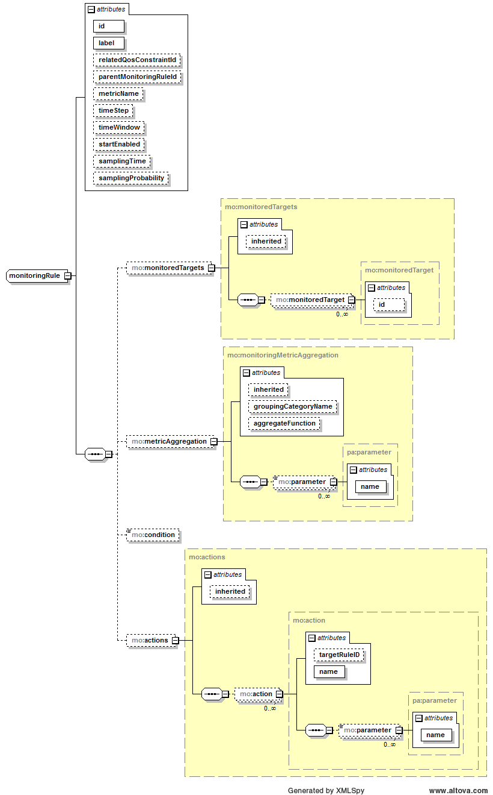

[Documentation table of contents](TOC.md) / User Manual

# User Manual

## The Monitoring Ontology

The monitoring ontology defines concepts concerning the system deployment model and their relations.

Here is a graphical representation of the ontology:


The ontology has been recently adapted to the ongoing development of [CloudML2.0](http://cloudml.org/)
which is currently synchronizing with 
[TOSCA](https://www.oasis-open.org/committees/tc_home.php?wg_abbrev=tosca).

## What is a QoS Constraint?

TODO

## What is a Monitoring Rule?

Monitoring rules are "recipes" that describe what and how the monitoring platform should monitor and how monitoring data should be aggregated. The user can also specify actions to be performed and conditions under which actions should be performed.

The metamodel of a monitoring rule is formally specified as an XML schema, available [here](https://github.com/deib-polimi/modaclouds-qos-models/blob/master/metamodels/monitoringrules/monitoring_rules_schema.xsd).

Here is a graphical representation of the schema:



Here is a list of the attributes with a short description:
- *metricName*: the name of the target metric
- *monitoredTargets*: the list of targets resources targeted by the rule
- *metricAggregation*: specifies how data should be transformed
- *timeStep*: time interval in seconds between two consecutive evaluations of the rule
- *timeWindow*: time range in seconds in which data should be considered to be aggregated at every time step
- *startEnabled*: specifies whether the rule evaluation should start once installed
- *relatedQosConstraintId*: if specified, identifies the id of the qos constraint from which the rule is generated
- *parentMonitoringRuleId*: if specified, identifies the id of the parent monitoring rule
- *condition*: the condition to be evaluated on the aggregated metric or, in case no aggregation is specified, on raw data
- *actions*: the list of actions to be executed for each monitoring datum (produced by aggregation or raw datum).
If a condition is specified the action is performed if and only if the condition is verified.

### Condition

#### Syntax

```
<condition> ::= <term> | <term> ` || ' <condition>

<term> ::= <factor> | <factor> ` && ' <term>

<factor> ::= <atom> | `!' <factor> | `(' <condition> `)'

<atom> ::= <var> <operator> <var> 
		| `maxOccurrence(' <metric_id> `,' <int> `)'
		| `minOccurrence(' <metric_id> `,' <int> `)'
		| `parentCondition'
		
<var> ::= `METRIC' | <decimal>

<operator> ::= `>=' | `<=' | `=' | `<>' | `>' | `<'
```

#### Semantics

- <metric_id> in maxOccurrence and minOccurrence must refer to a *returnedMetric* of an existing monitoring
rule executing action *OutputMetric*.
- parentCondition can be used only if the monitoring rule whose condition is under evaluation has a parent rule

## Examples

Examples of monitoring rules are available at [this link](https://github.com/deib-polimi/modaclouds-qos-models/blob/master/metamodels/examples/MonitoringRules.xml).

## Installation

If you need the jar-with-dependencies run:

```
mvn package assembly:single
```

If you need to run the batch tool, build the jar-with-dependencies and then run:

```
java -cp qos-models-2.1.3-jar-with-dependencies.jar it.polimi.modaclouds.qos_models.batch.BatchTool
```


If you need to add qos-models as a maven dependency, here is the repo:

Releases repository:
```xml
<repository>
	<id>deib-polimi-releases</id>
	<url>https://github.com/deib-polimi/deib-polimi-mvn-repo/raw/master/releases</url>
</repository>
```

Dependency:
```xml
<dependencies>
	<dependency>
		<groupId>it.polimi.modaclouds.qos-models</groupId>
		<artifactId>qos-models</artifactId>
		<version>VERSION</version>
	</dependency>
</dependencies>
```


##Usage

Have a look at test classes for more examples on the usage.

### Convert XML to Java Object

Example:
```java
import it.polimi.modaclouds.qos_models.util.XMLHelper;
import it.polimi.modaclouds.qos_models.schema.MonitoringRules;
...
URL monitoringRulesURL = new URL("path/to/monitoringRules.xml");
MonitoringRules monitoringRules = XMLHelper.deserialize(monitoringRulesURL, MonitoringRules.class);
```

### Convert Java Object to XML

Example:
```java
import it.polimi.modaclouds.qos_models.util.XMLHelper;
import it.polimi.modaclouds.qos_models.schema.MonitoringRules;
...
XMLHelper.serialize(monitoringRules, MonitoringRules.class, System.out);
```

### Automatic Generation of Monitoring Rules

Use the MonitoringRuleFactory class to generate monitoring rules from QoS constraints.

Example:
```java
import it.polimi.modaclouds.qos_models.monitoring_rules.MonitoringRuleFactory;
import it.polimi.modaclouds.qos_models.schema.MonitoringRule;
import it.polimi.modaclouds.qos_models.schema.Constraint;
...
MonitoringRuleFactory factory = new MonitoringRuleFactory();
MonitoringRule monitoringRule = factory.makeRuleFromConstraint(constraint);
```

### How to validate a monitoring rule

Use the RuleValidator class to validate rules.
